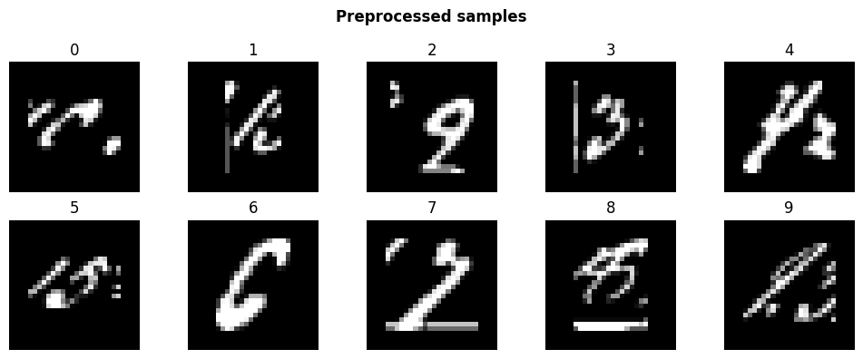
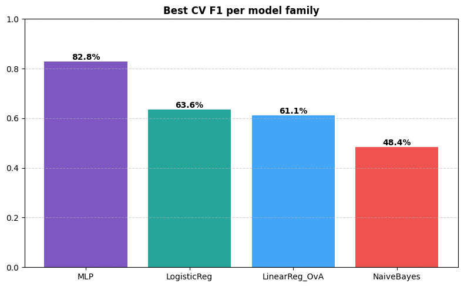
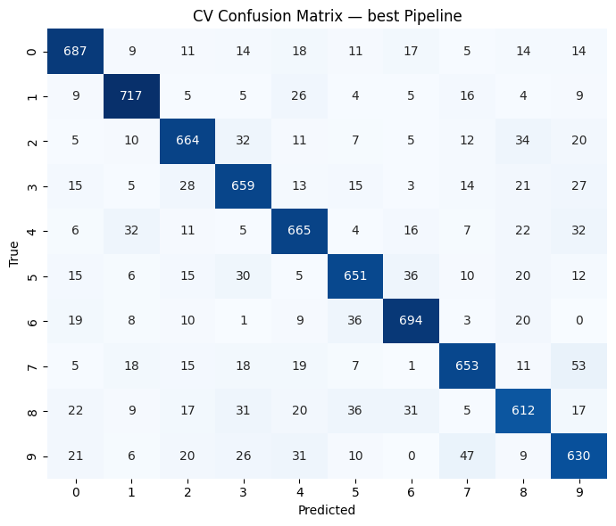

# HelloML

**Handwritten digit OCR on the DIDA dataset** — Colab-oriented, single Pipeline + GridSearchCV, train/load modes.

| Item | Detail |
|------|--------|
| **Task** | Multi-class digit classification (0–9) |
| **Dataset** | DIDA (1,000 images × 10 digits = **10,000**) |
| **Split** | 80% train / 20% test (stratified) |
| **Models** | GaussianNB · Linear Regression (OvA) · Logistic Regression · **MLP** |
| **Search** | One `Pipeline` + one `GridSearchCV` over all model families |
| **Best result** | **MLP (700, 200)** — CV F1 **82.8%**, Test accuracy **83.2%** |
| **Main notebook** | [`OCR_HelloML_Complete.ipynb`](OCR_HelloML_Complete.ipynb) |
| **Helpers** | [`helloml_pipeline.py`](helloml_pipeline.py) |

---

## Repository / Drive layout

Designed for **Google Colab** with the project folder on Drive:

```text
OCR_HelloML Project/
├── Dataset/
│   ├── DIDA/0..9              ← raw images
│   └── DIDA_Processed/0..9    ← preprocessed PNGs (written on train)
├── Saved Variables/           ← *.joblib (grid, arrays, metrics)
├── helloml_pipeline.py
└── OCR_HelloML_Complete.ipynb
```

On GitHub the same files live at the repo root (`OCR_HelloML_Complete.ipynb`, `helloml_pipeline.py`, `README.md`, `assets/`).

---

## Modes

| `RUN_MODE` | Meaning |
|------------|---------|
| **1** | Train — load DIDA → preprocess → save PNGs → GridSearchCV → evaluate → save joblib |
| **2** | Load — restore joblib artifacts → evaluate / plot (no training) |

```python
RUN_MODE = 1   # or 2
```

---

## Pipeline

```text
Load DIDA
  → Median blur → K-Means binarize → crop → scale → center on 28×28
  → Save PNGs to Dataset/DIDA_Processed/{0..9}/
  → Normalize + flatten (784) + stratified 80/20 split
  → One Pipeline + GridSearchCV (all 4 model families, 5-fold, refit=f1)
  → Save full grid + best estimator + metric tables to Saved Variables/
  → Confusion matrix, classification report, charts
```

### Preprocessing steps

| Step | Operation | Why |
|------|-----------|-----|
| 1 | Median blur 3×3 | Denoise stains / salt-pepper |
| 2 | K-Means (k=2) | Adaptive ink vs background |
| 3 | Bounding-box crop | Drop empty margins |
| 4 | Scale longest side → 20 px | Size normalization |
| 5 | Center on 28×28 canvas | Fixed spatial layout |
| 6 | `/255` + flatten | Features in [0, 1], shape `(N, 784)` |

### Preprocessed samples



---

## Models & hyperparameter grid

One `sklearn.pipeline.Pipeline` with a multi-dict `param_grid`:

| Family | Tuned params |
|--------|----------------|
| **NaiveBayes** | — |
| **LinearReg_OvA** | One-vs-All `LinearRegression` |
| **LogisticReg** | `C ∈ {1.0, 10.0}` |
| **MLP** | `hidden_layer_sizes`: `(700,200)`, `(500,100,10)`, `(300,150,100,50,10)` |

Scoring: accuracy, precision_macro, recall_macro, **f1_macro** (refit).

---

## Results (latest run)

**Best params:** `MLPClassifier`, `hidden_layer_sizes=(700, 200)`  
**Best CV F1:** **0.828** · **Test accuracy:** **0.832**  
GridSearch: 7 candidates × 5 folds = 35 fits (~10 min on Colab).

### Best CV F1 per model family

| Model | Mean Acc | Mean F1 | Mean Fit Time (s) |
|-------|----------|---------|-------------------|
| **MLP** | 0.828 | **0.828** | ~69 |
| LogisticReg | 0.636 | 0.636 | ~10 |
| LinearReg_OvA | 0.613 | 0.611 | ~9 |
| NaiveBayes | 0.484 | 0.484 | ~0.1 |



### CV confusion matrix (best Pipeline)



### Test set (held-out 2000 images)

| Metric | Value |
|--------|-------|
| **Test accuracy** | **0.832** |
| Macro precision | 0.833 |
| Macro recall | 0.832 |
| Macro F1 | 0.832 |

Per-digit F1 is strongest on 1 and 6 (~0.86); 8 and 9 are the hardest (~0.79).

---

## Artifacts (`Saved Variables/`)

After `RUN_MODE = 1`:

| File | Contents |
|------|----------|
| `grid.joblib` | Full `GridSearchCV` (cv_results_, best_params_, …) |
| `best_estimator.joblib` | Winning Pipeline |
| `X_train/X_test/y_*.joblib` | Split arrays |
| `X_proc.joblib`, `y.joblib` | Preprocessed images + labels |
| `df_cv_all.joblib`, `df_cv_best.joblib`, `df_test.joblib` | Metric tables |

With `RUN_MODE = 2` you can still use:

```python
grid.best_params_
grid.cv_results_
grid.best_estimator_.predict(X_test)
```

---

## Quick start (Google Colab)

1. Put the project under Drive as `MyDrive/OCR_HelloML Project/` with `Dataset/DIDA/0..9` filled.
2. Open `OCR_HelloML_Complete.ipynb` in Colab.
3. Set `RUN_MODE = 1` and run all cells (first run trains and writes artifacts + PNGs).
4. Later sessions: set `RUN_MODE = 2` to skip training.

Local / non-Colab: comment out the `drive.mount` cell and set `ROOT_DIR` / `os.chdir` to your project folder.

---

## Requirements

```text
numpy pandas scikit-learn opencv-python matplotlib seaborn joblib
```

On Colab these are available or installable with `pip`.
